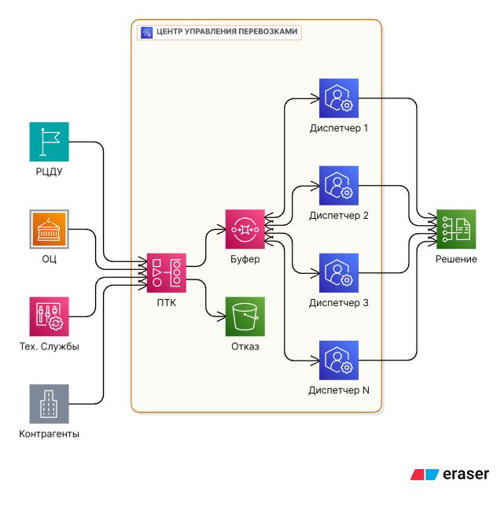
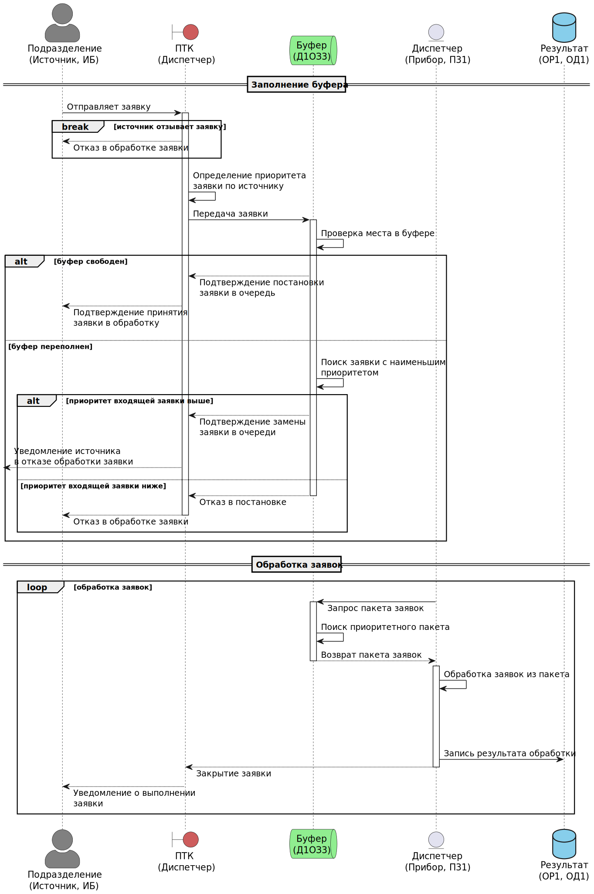
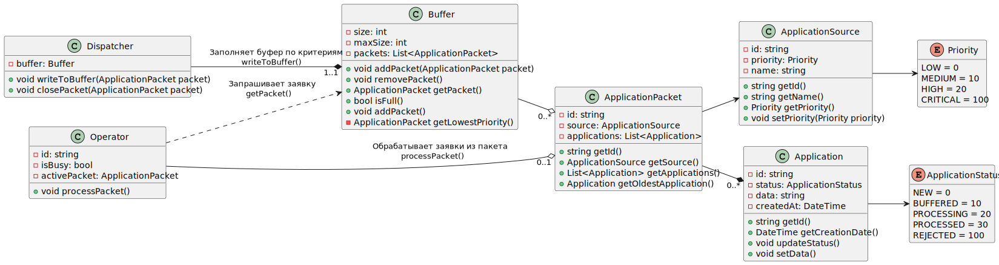
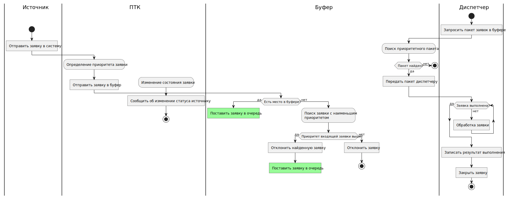

# Архитектура программных систем
В качестве примера работы системы массового обслуживания рассмотрим работу центра управления перевозками (далее – «ЦУП») ОАО «РЖД». ЦУП взаимодействует с другими подразделениями ОАО «РЖД» и принимает от них заявки. Из-за большого количества подразделений невозможно обработать все заявки, поэтому автоматизированная система распределяет их по приоритету и в пик нагрузки отклоняет низкоприоритетные заявки.
Вариант № 10
|ИБ|И32|П31|Д1ОЗ3|Д1ОО2|Д2П2|Д2Б5|ОР1|ОД1|
|-|-|-|-|-|-|-|-|-|

## Бизнес-домен
### Элементы бизнес-домена
1. **Источник (ИБ, ИЗ2):** Структурные подразделения ОАО «РЖД» направляют заявки в ЦУП. Поток заявок бесконечный, но распределен равномерно.
2. **Буфер (Д1ОЗ3):** Взаимодействие подразделений с ЦУП происходит посредством программно-технологического комплекса (далее – «ПТК»). Комплекс обрабатывает заявки и либо отклоняет их, либо направляет в буфер. Заявка встанет в очередь на первое от начала свободное место, если такое найдется. Сдвига очереди в этом случае не происходит.
3. **Прибор (П31):** Диспетчер центра получает заявки. Время на обработку случайное, экспоненциально распределенное.
4. **Дисциплина отказа (Д1ОО2):** При переполнении очереди отклоняются заявки с наименьшим приоритетом. Например, заявки из департамента обеспечения безопасности будут приоритетнее заявок от региональных центров диспетчерского управления (РЦДУ).
5. **Дисциплины постановки на обслуживание (Д2П2, Д2Б5):**
   -	Д2Б5 (выбор заявок пакетами по источнику) – диспетчер обрабатывает заявки приоритетного источника одну за другой, когда все заявки источника будут обработаны, диспетчер перейдет к следующему по приоритету источнику;
   -	Д2П2 (выбор прибора по кольцу) – выбор диспетчера происходит циклично по кругу.
6. **Заявка:** Информация и/или запросы от различных структурных подразделений ОАО «РЖД», требующие обработки и переадресации.
7. Отражение результатов (ОР1, ОД1):
   -	Динамика – календарь событий, буфер и текущее состояние;
   -	Итоги – сводная таблица результатов (кол-во принятых/отклоненных заявок, среднее время ожидания и обслуживания).
### Схема работы ЦУП

## Артефакты
### Sequence-диаграмма

### Диаграмма классов

### Flowchart диаграмма

> [!CAUTION]
> Центр управления перевозками был взят в качестве примера реальной системы массового обслуживания. Схема работы ЦУПа была придумана автором на основе открытых данных из сети Интернет и не отражает реальное поведение подобных систем.
